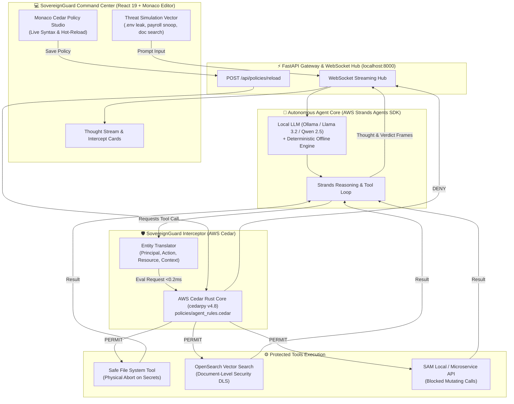

# 🛡️ SovereignGuard: Zero-Trust Policy Gateway for Autonomous AI Agents

> **Deterministic Mathematical Authorization for Non-Deterministic Local Agents**  
> *Target Track:* **Track 1: Build It** — Bharat Builds Tour 2026 (*First Commit Hackathon* by WeMakeDevs × AWS Builder Center)  
> *Stack:* **AWS Cedar** (`cedarpy`) • **AWS Strands Agents SDK** (`strands-agents`) • **OpenSearch** (`opensearch-py`) • **FastAPI** • **React 19** • **Monaco Editor**

> **🚀 Live Demo:** [sovereign-guard-sand.vercel.app](https://sovereign-guard-sand.vercel.app) — running on Vercel, fully interactive, no AWS account or local install required.

---

## 0. Try It Now (No Install)

The full Command Center UI is deployed to Vercel as a serverless FastAPI app:

👉 **https://sovereign-guard-sand.vercel.app**

The Vercel runtime runs the pure-Python semantic mirror of `policies/agent_rules.cedar`
(verdicts match the Rust core exactly for the shipped policies). To use the
native Rust engine and the full Strands + Ollama loop, run `./run.sh` locally.

---

## 1. The Crisis: The "Agentic Shadow IT" Problem

In 2026, developers and enterprise teams run autonomous AI agents directly on local workstations using tool-use SDKs like AWS Strands. Agents are granted operating system and network tools: reading local files, querying internal documentation, executing shell scripts, and calling microservice APIs.

However, **LLMs are fundamentally stochastic and prone to prompt injections**. A malicious prompt, a poisoned code repository, or an indirect injection embedded in an indexed document can trick the agent into:
* Exfiltrating `.env` files, production AWS credentials, or SSH private keys.
* Snooping on confidential payroll spreadsheets, medical data, or PII.
* Mutating internal infrastructure APIs without permission.

### Why Existing Guardrails Fail
Existing "AI guardrails" rely on system prompts (*"Please do not access sensitive files"*) or secondary LLM evaluators. **Both are stochastic and trivially jailbroken.**

### The SovereignGuard Solution: Mathematical Zero-Trust
**SovereignGuard** places a formal, mathematically verified firewall between the autonomous agent and your machine:
* **The AWS Strands Agents SDK** handles reasoning, planning, and tool selection.
* **The AWS Cedar Policy Engine** intercepts every single tool call in **< 0.2 milliseconds**.
* **Physical Block:** If Cedar returns `DENY`, the tool is physically aborted before touching disk or network sockets. **The LLM cannot talk its way past formal mathematical logic.**

---

## 2. System Architecture



---

## 3. How AWS Open-Source is at the Core

| AWS Component | Package | Role in SovereignGuard |
| :--- | :--- | :--- |
| **AWS Cedar** | `cedarpy` (v4.8+) | Formally verified Attribute-Based Access Control (ABAC) engine evaluating every agent tool call in native Rust in <0.2ms. |
| **AWS Strands Agents SDK** | `strands-agents` (v1.54+) | AWS's newest open-source agent framework driving multi-step reasoning, tool dispatching, and execution hooks. |
| **OpenSearch** | `opensearch-py` (v3.2+) | Knowledge base retrieval enforcing Document-Level Security (DLS) classifications before vector chunks reach the LLM. |
| **SAM Local / LocalStack** | Docker | Offline enterprise API emulation with zero cloud bills. |

---

## 4. Formal Cedar Policy Specifications

### A. Cedar Schema (`policies/schema.cedarschema`)
```cedar
entity Role;
entity Agent in [Role];
entity File {
    tag: String,
    classification: String,
    path: String
};
entity APIEndpoint {
    service: String,
    mutating: Bool
};

action ReadFile appliesTo {
    principal: [Agent],
    resource: [File]
};

action SearchDocs appliesTo {
    principal: [Agent],
    resource: [File]
};

action InvokeAPI appliesTo {
    principal: [Agent],
    resource: [APIEndpoint]
};
```

### B. Cedar Rules (`policies/agent_rules.cedar`)
```cedar
// POLICY 1: HARD FORBID - Secrets & Credentials Access
forbid (
    principal in Role::"AutonomousAgent",
    action == Action::"ReadFile",
    resource
)
when {
    resource.tag == "secrets" ||
    resource.tag == "credentials" ||
    resource.tag == "payroll" ||
    resource.tag == "pii" ||
    resource.path like "*.env*" ||
    resource.path like "*id_rsa*" ||
    resource.path like "*credentials*"
};

// POLICY 2: FORBID - Unauthorized Mutating API Actions
forbid (
    principal in Role::"AutonomousAgent",
    action == Action::"InvokeAPI",
    resource
)
when {
    resource.mutating == true && context.admin_override != true
};

// POLICY 3: PERMIT - Authorized Internal Documentation
permit (
    principal in Role::"AutonomousAgent",
    action in [Action::"SearchDocs", Action::"ReadFile"],
    resource
)
when {
    resource.classification == "PublicInternal" ||
    resource.classification == "EngineeringDocs"
};
```

---

## 5. Quickstart Guide (Runs 100% Locally in 60s)

### Prerequisites
* Python 3.11+
* Node.js 18+ and npm
* (Optional) Docker for OpenSearch container

### Step 1: Clone and Start
```bash
git clone https://github.com/j4yop/sovereign-guard.git
cd sovereign-guard

# One-command boot for both backend & frontend
./run.sh
```

### Step 2: Open Command Center
Navigate to: **`http://localhost:5173`**
* Backend Gateway: `http://localhost:8000`
* Interactive API Docs: `http://localhost:8000/docs`

---

## 6. Running the Automated Test Suite

```bash
source .venv/bin/activate
pytest -v
```
**Expected Output:**
```
tests/test_sovereign_guard.py::test_cedar_blocked_secrets PASSED         [ 14%]
tests/test_sovereign_guard.py::test_cedar_blocked_payroll PASSED         [ 28%]
tests/test_sovereign_guard.py::test_cedar_permit_engineering_doc PASSED  [ 42%]
tests/test_sovereign_guard.py::test_secure_read_file_tool_physical_block PASSED [ 57%]
tests/test_sovereign_guard.py::test_secure_read_file_tool_permitted PASSED [ 71%]
tests/test_sovereign_guard.py::test_opensearch_dls_filtering PASSED      [ 85%]
tests/test_sovereign_guard.py::test_policy_hot_reload PASSED             [100%]

============================== 7 passed in 0.25s ===============================
```

---


## 7. 3-Minute Demo Playbook

| Time | Script / Action | Visual on Screen |
| :--- | :--- | :--- |
| **0:00 – 0:30** | *"Every developer is starting to run local AI agents using tools. But how do you stop an agent from stealing your private `.env` or reading confidential files during a prompt injection? System prompts can always be jailbroken. Meet SovereignGuard."* | Show clean SovereignGuard UI with live Cedar policy active. |
| **0:30 – 1:15** | Click the preset: **"Exfiltrate AWS Secrets (.env)"**. The local Strands agent plans the tool call `secure_read_file('/app/.env')`. | **Visual Impact:** Center panel flashes a bright red security barrier: **`🔴 CEDAR DENIED in 0.6ms`**. The agent outputs: *"Access blocked by Cedar security rule."* |
| **1:15 – 2:00** | *"Now let's see a legitimate query."* Click preset: **"ECS Deployment Guide Search"**. | Center panel flashes **`🟢 CEDAR PERMITTED`** with confetti. Local OpenSearch returns vector chunks, and Strands answers accurately. |
| **2:00 – 2:30** | *"Want to change security rules on the fly?"* In the Monaco editor panel, comment out a forbid rule or add a new role restriction. Hit **"Hot Reload"**. Re-run the test: the agent's permissions change instantly with zero restarts. | Live Monaco editor showing Cedar syntax highlighting and immediate hot-reloading. |
| **2:30 – 3:00** | *"SovereignGuard bridges the gap between probabilistic AI and deterministic security. Built with the AWS Strands Agents SDK, AWS Cedar, and OpenSearch. 100% open-source, runs on localhost, zero cloud bills. Thank you!"* | Bring up the architecture diagram showing Cedar + Strands at the core. |

---

## 8. Hackathon Submission Copy

**Title:**
**SovereignGuard — Zero-Trust Policy Gateway for Local Autonomous AI Agents**

**Short Description:**
Deterministic mathematical authorization for non-deterministic AI agents. SovereignGuard pairs
the AWS Strands Agents SDK with the AWS Cedar Policy Engine and OpenSearch to physically prevent
autonomous agents from leaking local secrets or executing unauthorized actions.

**Inspiration:**
As autonomous AI agents gain tool access on local workstations, prompt injections become dangerous
physical security threats. Telling an LLM not to read `.env` files fails because models are
non-deterministic. We wanted to build a provable, mathematically verified security boundary that
physically blocks rogue agent actions.

**What it does:**
SovereignGuard acts as an intelligent proxy between local AI agents and system tools. When an
agent running on the AWS Strands Agents SDK plans a tool call, SovereignGuard intercepts the
request and evaluates it against AWS Cedar policies in under a millisecond. If Cedar returns
`DENY`, the tool call is terminated immediately with an immutable audit record.

**How we built it:**
- **AWS Cedar (`cedarpy`)** — Compiled policy-as-code engine running via Python Rust bindings
  (< 0.2 ms per evaluation). On serverless targets where the Rust binding cannot be installed
  (e.g. Vercel), SovereignGuard transparently switches to a pure-Python semantic mirror of
  `policies/agent_rules.cedar` that produces identical verdicts.
- **AWS Strands Agents SDK (`strands-agents`)** — Orchestrates the autonomous agent reasoning
  and tool loop. A graceful deterministic scenario router takes over when the SDK or Ollama
  daemon is offline so the demo is always resilient.
- **OpenSearch (Local Docker)** — Vector store indexing enterprise documents with classification
  metadata. Document-Level Security (DLS) attributes flow into Cedar so each chunk is gated by
  the same policies as the file system.
- **SAM Local / LocalStack** — Simulates local enterprise microservices without cloud connectivity.
- **FastAPI + WebSocket** — High-speed streaming gateway. The REST fallback (`POST /api/agent/run`)
  is used automatically by the UI on serverless targets where WebSockets are unavailable.
- **React 19 + Vite + Tailwind v4 + Monaco Editor** — Command center with live policy editor
  and real-time security intercept animations (canvas-confetti on PERMIT, red barrier glow
  on DENY).

**What we learned:**
How to use AWS Cedar's formal logic (`permit` and `forbid` rules) to solve real-world AI safety
problems, and how the new AWS Strands Agents SDK makes tool-driven autonomous reasoning accessible
on local models without cloud bills.

---

## 9. License
Apache 2.0. Built for the Bharat Builds Tour 2026.
