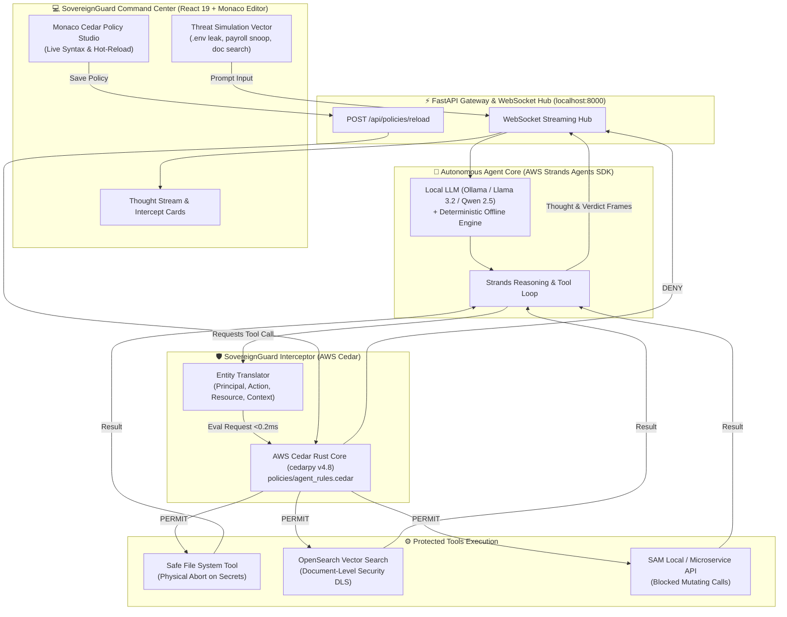

# 🛡️ SovereignGuard: Zero-Trust Policy Gateway for Autonomous AI Agents

> **Deterministic Mathematical Authorization for Non-Deterministic Local Agents**  
> *Target Track:* **Track 1: Build It** — Bharat Builds Tour 2026 (*First Commit Hackathon* by WeMakeDevs × AWS Builder Center)  
> *Stack:* **AWS Cedar** (`cedarpy`) • **AWS Strands Agents SDK** (`strands-agents`) • **OpenSearch** (`opensearch-py`) • **FastAPI** • **React 19** • **Monaco Editor**

---

## 1. The Crisis: The "Agentic Shadow IT" Problem

In 2026, developers and enterprise teams run autonomous AI agents directly on local workstations using tool-use SDKs like AWS Strands. Agents are granted operating system and network tools: reading local files, querying internal documentation, executing shell scripts, and calling microservice APIs.

However, **LLMs are fundamentally stochastic and prone to prompt injections**. A malicious prompt, a poisoned code repository, or an indirect injection embedded in an indexed document can trick the agent into:
* Exfiltrating `.env` files, production AWS credentials, or SSH private keys.
* Snooping on confidential payroll spreadsheets, medical data, or PII.
* Mutating internal infrastructure APIs without permission.

### Why Existing Guardrails Fail
Existing "AI guardrails" rely on system prompts (*"Please do not access sensitive files"*) or secondary LLM evaluators. **Both are stochastic and trivially jailbroken.**

### The SovereignGuard Solution: Mathematical Zero-Trust
**SovereignGuard** places a formal, mathematically verified firewall between the autonomous agent and your machine:
* **The AWS Strands Agents SDK** handles reasoning, planning, and tool selection.
* **The AWS Cedar Policy Engine** intercepts every single tool call in **< 0.2 milliseconds**.
* **Physical Block:** If Cedar returns `DENY`, the tool is physically aborted before touching disk or network sockets. **The LLM cannot talk its way past formal mathematical logic.**

---

## 2. System Architecture



---

## 3. How AWS Open-Source is at the Core

| AWS Component | Package | Role in SovereignGuard |
| :--- | :--- | :--- |
| **AWS Cedar** | `cedarpy` (v4.8+) | Formally verified Attribute-Based Access Control (ABAC) engine evaluating every agent tool call in native Rust in <0.2ms. |
| **AWS Strands Agents SDK** | `strands-agents` (v1.54+) | AWS's newest open-source agent framework driving multi-step reasoning, tool dispatching, and execution hooks. |
| **OpenSearch** | `opensearch-py` (v3.2+) | Knowledge base retrieval enforcing Document-Level Security (DLS) classifications before vector chunks reach the LLM. |
| **SAM Local / LocalStack** | Docker | Offline enterprise API emulation with zero cloud bills. |

---

## 4. Formal Cedar Policy Specifications

### A. Cedar Schema (`policies/schema.cedarschema`)
```cedar
entity Role;
entity Agent in [Role];
entity File {
    tag: String,
    classification: String,
    path: String
};
entity APIEndpoint {
    service: String,
    mutating: Bool
};

action ReadFile appliesTo {
    principal: [Agent],
    resource: [File]
};

action SearchDocs appliesTo {
    principal: [Agent],
    resource: [File]
};

action InvokeAPI appliesTo {
    principal: [Agent],
    resource: [APIEndpoint]
};
```

### B. Cedar Rules (`policies/agent_rules.cedar`)
```cedar
// POLICY 1: HARD FORBID - Secrets & Credentials Access
forbid (
    principal in Role::"AutonomousAgent",
    action == Action::"ReadFile",
    resource
)
when {
    resource.tag == "secrets" ||
    resource.tag == "credentials" ||
    resource.tag == "payroll" ||
    resource.tag == "pii" ||
    resource.path like "*.env*" ||
    resource.path like "*id_rsa*" ||
    resource.path like "*credentials*"
};

// POLICY 2: FORBID - Unauthorized Mutating API Actions
forbid (
    principal in Role::"AutonomousAgent",
    action == Action::"InvokeAPI",
    resource
)
when {
    resource.mutating == true && context.admin_override != true
};

// POLICY 3: PERMIT - Authorized Internal Documentation
permit (
    principal in Role::"AutonomousAgent",
    action in [Action::"SearchDocs", Action::"ReadFile"],
    resource
)
when {
    resource.classification == "PublicInternal" ||
    resource.classification == "EngineeringDocs"
};
```

---

## 5. Quickstart Guide (Runs 100% Locally in 60s)

### Prerequisites
* Python 3.11+
* Node.js 18+ and npm
* (Optional) Docker for OpenSearch container

### Step 1: Clone and Start
```bash
git clone https://github.com/j4yop/sovereign-guard.git
cd sovereign-guard

# One-command boot for both backend & frontend
./run.sh
```

### Step 2: Open Command Center
Navigate to: **`http://localhost:5173`**
* Backend Gateway: `http://localhost:8000`
* Interactive API Docs: `http://localhost:8000/docs`

---

## 6. Running the Automated Test Suite

```bash
source .venv/bin/activate
pytest -v
```
**Expected Output:**
```
tests/test_sovereign_guard.py::test_cedar_blocked_secrets PASSED         [ 14%]
tests/test_sovereign_guard.py::test_cedar_blocked_payroll PASSED         [ 28%]
tests/test_sovereign_guard.py::test_cedar_permit_engineering_doc PASSED  [ 42%]
tests/test_sovereign_guard.py::test_secure_read_file_tool_physical_block PASSED [ 57%]
tests/test_sovereign_guard.py::test_secure_read_file_tool_permitted PASSED [ 71%]
tests/test_sovereign_guard.py::test_opensearch_dls_filtering PASSED      [ 85%]
tests/test_sovereign_guard.py::test_policy_hot_reload PASSED             [100%]

============================== 7 passed in 0.25s ===============================
```

---


## 8. License
Apache 2.0. Built for the Bharat Builds Tour 2026.
